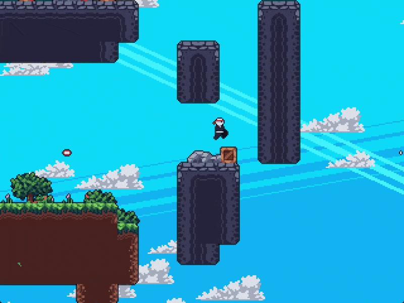
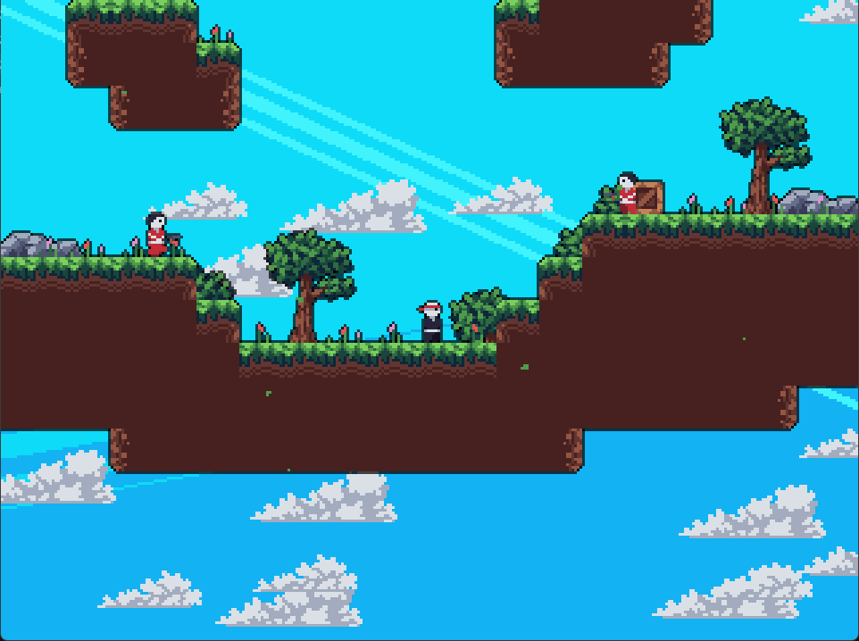

# My Motivation
Recently I decided to take a break from AI and Agentic this, Agentic that and tried the field of Game Development and boy, it is hard... <br>
I noticed that game development is all math, physics, calculus, and geometry (at least as deep as I got into it) and I LOVE IT! <br>
It has been a fantastic couple of weeks trying Pygame in Python to develop games and not relying on a game engine, implementing your own tools like level editors and collision handling with masks and projectile management and optimizations and ... it has all been really fun and educational. <br>
I might end up switching to a game engine like Godot if I want to develop any more games since I think developing without a game engine can be a great learning journey but I want to put the little time I have into making fun games as my side project rather than dumping huge hours into fixing a pixel-perfect collision handling. <br>
Anyways it has been a great two-week journey, but I am afraid it is time for me to get back to the AI field and learn more things there since learning is like a rabbit hole and the more you learn, the more you get stuck into this rabbit hole and want to go deeper and deeper to learn more and more and since the current trend is AI, I think invesing some time in that field can be more beneficial for me, I will not abandon the game development, however.

# Ninja Game

A simple 2D platformer built with Python and Pygame as a personal learning project.

The goal is straightforward: progress through three levels and defeat all enemies using your dash ability. The project focuses on learning the fundamentals of 2D game development, including player movement, physics, collisions, enemy behavior, particles, tilemaps, animations, and level editing.

<div align="center">



</div>

## 🎮 Gameplay

You control a ninja character who must clear each level by defeating every enemy.

The main mechanics include:

* **Movement:** Move left and right with `A` / `D` or the arrow keys.
* **Jumping:** Jump using `Space` or `Up`.
* **Wall sliding:** Slide along walls while airborne and perform wall jumps.
* **Dashing:** Dash using `V` or `Left Ctrl`. Dashing is the main way to defeat enemies.
* **Enemies:** Enemies move around the level and can shoot projectiles at the player.
* **Level progression:** Clear all enemies to advance to the next level.
* **Particles and effects:** Dash trails, sparks, leaves, and other particle effects add visual feedback during gameplay.
* **Camera:** The camera smoothly follows the player while exploring the levels.

There are currently three levels to play through.

<div align="center">



</div>

## 🗺️ Tilemap Editor

The project includes a built-in tilemap editor that can be used to create and modify maps.

The editor supports placing and removing tiles, working with different tile groups and variants, scrolling around the map, and working with both grid and off-grid tiles.

It also includes an autotiling system for automatically selecting appropriate grass and stone tile variants based on neighboring tiles.

### Editor Controls

| Key / Input | Action                         |
| ----------- | ------------------------------ |
| Left Click  | Place tile                     |
| Right Click | Remove tile                    |
| Mouse Wheel | Change tile group or variant   |
| `Shift`     | Switch tile variant            |
| `G`         | Toggle grid/off-grid placement |
| `T`         | Autotile                       |
| `O`         | Save map                       |

Maps are saved to `map.json`.

## 📁 Project Structure

```text
📁
├── 📁 data
│   ├── 📁 images
│   │   ├── 📁 clouds
│   │   ├── 📁 entities
│   │   │   ├── 📁 enemy
│   │   │   │   ├── 📁 idle
│   │   │   │   └── 📁 run
│   │   │   └── 📁 player
│   │   │       ├── 📁 idle
│   │   │       ├── 📁 jump
│   │   │       ├── 📁 run
│   │   │       ├── 📁 slide
│   │   │       └── 📁 wall_slide
│   │   ├── 📁 particles
│   │   │   ├── 📁 leaf
│   │   │   └── 📁 particle
│   │   └── 📁 tiles
│   │       ├── 📁 decor
│   │       ├── 📁 grass
│   │       ├── 📁 large_decor
│   │       ├── 📁 spawners
│   │       └── 📁 stone
│   ├── 📁 maps
│   │   ├── 🧩 0.json
│   │   ├── 🧩 1.json
│   │   └── 🧩 2.json
│   └── 📁 sfx
├── 📁 github_assets
├── 📁 scripts
│   ├── 🐍 clouds.py
│   ├── 🐍 editor.py
│   ├── 🐍 entities.py
│   ├── 🐍 particle.py
│   ├── 🐍 sparks.py
│   ├── 🐍 tilemap.py
│   └── 🐍 utils.py
├── 🐍 game.py
├── ⚖️ LICENSE
├── 🧩 map.json
├── 📘 README.md
└── 📝 requirements.txt
```

> Generated using [Tree Printer](https://github.com/AmirmasoudCS/Tree-Printer.git)

## ⚙️ Installation

Make sure you have **Python 3.12** installed.

Clone the repository and install the dependencies:

```bash
git clone https://github.com/AmirmasoudCS/Ninja-Game.git
cd Ninja-Game
pip install -r requirements.txt
```

Then run the game:

```bash
python game.py
```

## 📦 Running the Build

A packaged Windows build is also available. You can run the game's `.exe` directly without running the Python source code.

## 🎯 Controls

| Key                  | Action     |
| -------------------- | ---------- |
| `A` / `Left Arrow`   | Move left  |
| `D` / `Right Arrow`  | Move right |
| `Space` / `Up Arrow` | Jump       |
| `V` / `Left Ctrl`    | Dash       |

## 🛠️ Built With

* Python 3.12
* Pygame

## 🎨 Assets

The game's visual assets were sourced from **DaFluffyPotato** and are used as free assets for this personal learning project.

## ⚖️ License

This project is licensed under the MIT License. See [LICENSE](LICENSE) for details.

## 📌 Project Status

This project is considered finished in its current form. It was created as a small personal learning project, although it may be expanded or built upon in the future.
